# Panduan Retraining Model — Panel Admin (dengan screenshot)

> Versi in-app (dengan navigasi & bingkai browser): **`/docs/panduan-retraining`**.
> Latar belakang teknis, arsitektur, metrik, dan hasil percobaan: [`ML_RETRAINING.md`](ML_RETRAINING.md).
> Dataset gambar yang dipakai di panduan ini dikomit di [`dataset/aksara-bali-handwriting-v1/`](../dataset/aksara-bali-handwriting-v1/).

Panduan ini menuntun **admin** dari nol sampai punya model klasifikasi aksara Bali yang aktif di
produksi: *impor dataset → labeling → pilih arsitektur → latih → baca evaluasi → tetapkan model
produksi → uji & koreksi*. Semua screenshot direkam dari alur nyata pada panel
(`frontend/public/screenshots/ml/`, 1440×900). Waktu total alur dasar ± 10 menit, tanpa GPU.

## Daftar isi

0. [Ringkasan alur](#0-ringkasan-alur)
1. [Masuk ke panel Model ML](#1-masuk-ke-panel-model-ml)
2. [Siapkan dataset (impor dari repo)](#2-siapkan-dataset-impor-dari-repo)
3. [Tambah tulisan tangan nyata & labeling](#3-tambah-tulisan-tangan-nyata--labeling)
4. [Pilih arsitektur & jalankan retraining](#4-pilih-arsitektur--jalankan-retraining)
5. [Baca laporan evaluasi](#5-baca-laporan-evaluasi)
6. [Tetapkan model produksi](#6-tetapkan-model-produksi)
7. [Uji, bandingkan, koreksi](#7-uji-bandingkan-koreksi)
8. [Alur yang sama lewat API](#8-alur-yang-sama-lewat-api-otomasi)
9. [Pemecahan masalah](#9-pemecahan-masalah)

---

## 0. Ringkasan alur

| # | Tahap | Tab di `/admin/ml` | Hasil |
| --- | --- | --- | --- |
| 1 | Impor dataset dari repo (1.080 gambar berlabel) | Dataset & Labeling | Dataset siap latih, split 756/162/162 |
| 2 | Tambah & beri label tulisan tangan nyata | Dataset & Labeling | Sampel baru berlabel, masuk split |
| 3 | Pilih arsitektur + hyperparameter, jalankan job | Training | Model terlatih + laporan evaluasi otomatis |
| 4 | Bandingkan metrik, baca laporan per kelas | Model & Evaluasi | Model terbaik teridentifikasi |
| 5 | Jadikan model produksi | Model & Evaluasi | Dipakai `POST /api/ml/predict` |
| 6 | Uji tulisan, bandingkan model, koreksi → dataset | Percobaan | Data baru untuk retraining berikutnya |

**Prasyarat.** Backend berjalan (mode `dev` → setiap permintaan otomatis admin; mode `prod` →
login sebagai Admin di `/login`). Semua model murni NumPy di CPU. Paket dataset ada di folder
`dataset/` repo (Docker: disalin ke `/app/dataset`, env `AKSARA_DATASET_DIR`).

---

## 1. Masuk ke panel Model ML

Buka `/admin`. Seksi **“Model ML — Klasifikasi Aksara Bali”** menampilkan ringkasan dataset,
jumlah model, dan model produksi. Klik **Buka panel ML** (atau salah satu pintasan tab) untuk
masuk ke `/admin/ml`.

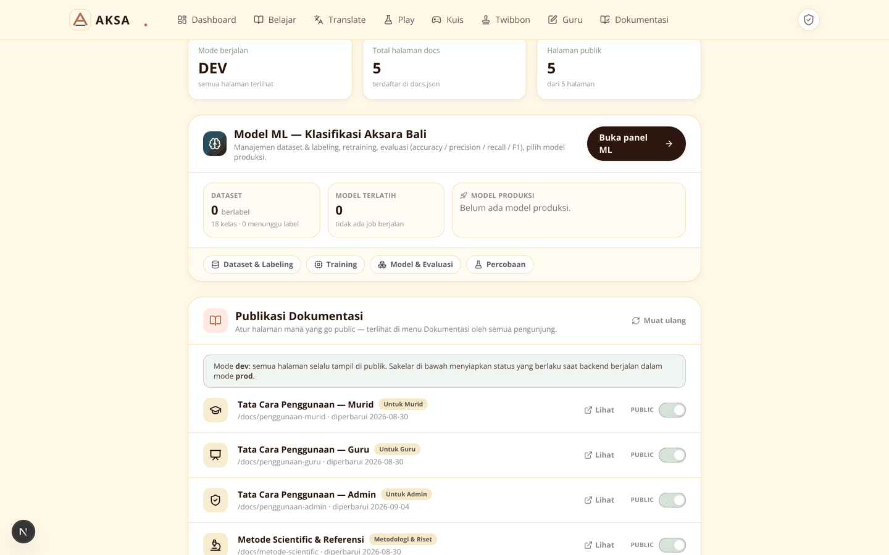
*Panel admin sebelum ada apa-apa: 0 sampel, 0 model, belum ada model produksi.*

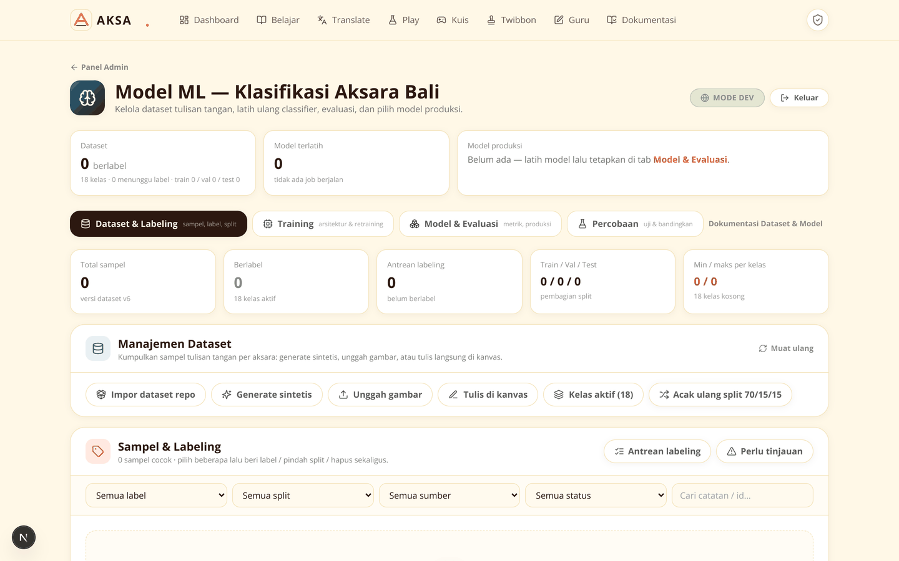
*Tab Dataset & Labeling saat kosong. Empat tab di atas mengikuti urutan alur kerja.*

---

## 2. Siapkan dataset (impor dari repo)

Repo menyertakan paket dataset gambar **`dataset/aksara-bali-handwriting-v1/`**: 1.080 PNG
64×64, 18 kelas Wresastra × 60 sampel, sudah berlabel, dengan split train/val/test
(756/162/162, stratified, seed 20260904) di `manifest.json`. Ini dataset yang sama dengan yang
dipakai percobaan di `ML_RETRAINING.md`, sehingga angka evaluasi bisa dibandingkan langsung.

1. Klik **Impor dataset repo** — panel menampilkan paket yang tersedia (jumlah gambar, kelas,
   split, seed, lisensi).
2. Periksa opsi impor: **Aktifkan kelas paket** (kelas aktif mengikuti manifest), **Ganti impor
   sebelumnya** (impor ulang tidak menggandakan data — idempoten), **Pakai split manifest**
   (matikan untuk acak ulang 70/15/15).
3. Klik **Impor 1.080 gambar** — ± 3–5 detik; statistik di atas langsung terisi.

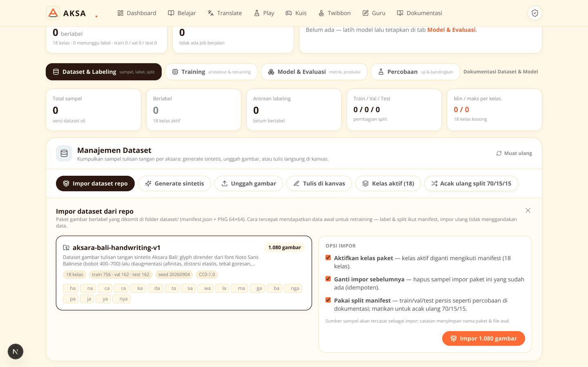
*Panel impor: paket aksara-bali-handwriting-v1 (1.080 gambar, 18 kelas, CC0) + tiga opsi impor.*

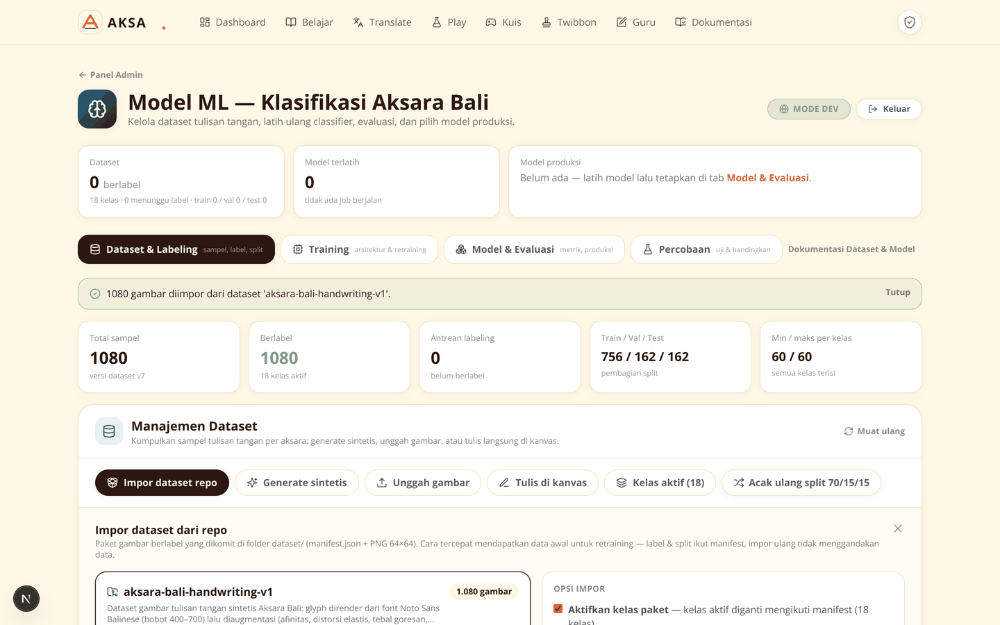
*Setelah impor: 1.080 sampel berlabel, 0 antrean, split 756 / 162 / 162.*

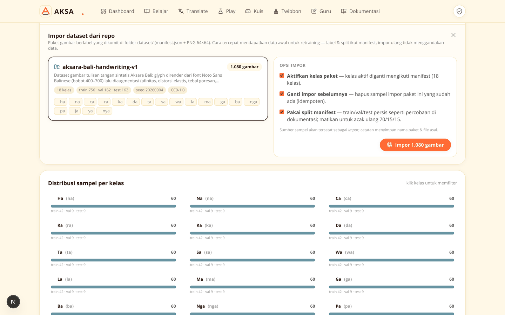
*Distribusi per kelas (klik kelas untuk memfilter galeri). Kelas tanpa data ditandai merah — training menolak sampai terisi.*

> **Alternatif: Generate sintetis.** Tombol *Generate sintetis* membuat sampel baru dari font
> Noto Sans Balinese dengan augmentasi (jumlah per kelas, seed, kekuatan). Berguna untuk kelas di
> luar Wresastra (Swalalita, Suara, Angka) yang tidak ada di paket repo. Paket dataset sendiri
> dibangun ulang dengan `.venv/bin/python eval/build_dataset.py` (lihat `dataset/.../README.md`).

---

## 3. Tambah tulisan tangan nyata & labeling

Dataset sintetis hanya titik awal; akurasi pada tulisan siswa naik bila dataset berisi
**tinta nyata**. Tiga jalur masuk:

1. **Unggah gambar** (PNG/JPG, banyak sekaligus). Label ditebak dari nama file (`ha_01.png` → *ha*)
   dan bisa diubah per file; kosongkan label untuk memasukkan gambar ke *antrean labeling*.
2. **Tulis di kanvas** — pilih label, (opsional) siluet pemandu, tulis, simpan.
3. **Koreksi dari tab Percobaan** — prediksi yang salah disimpan sebagai sampel dengan label benar (§7).

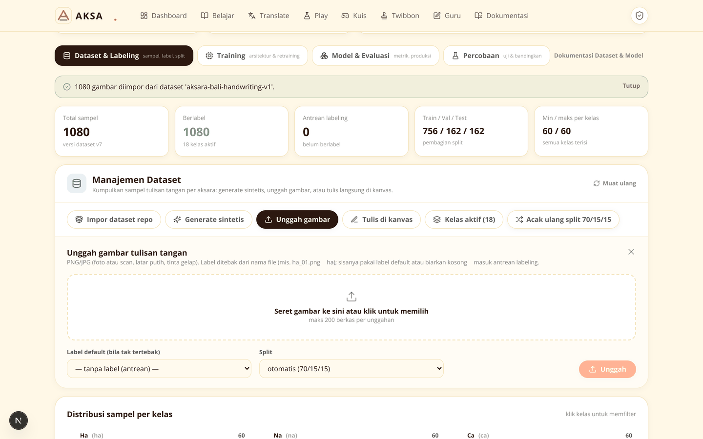
*Unggah gambar: pilih banyak file, tentukan label default & split, atau biarkan tanpa label.*

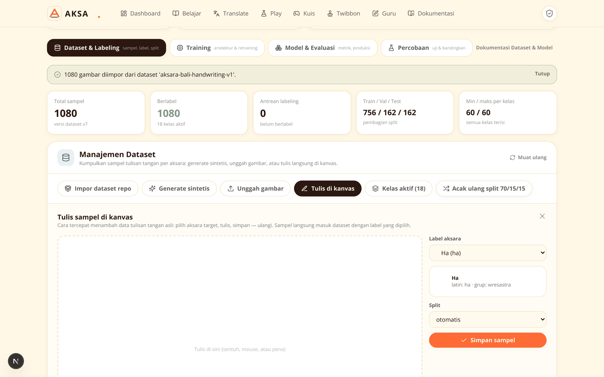
*Tulis di kanvas: pilih aksara target, tulis dengan mouse/pena/sentuh, simpan langsung ke dataset.*

**Kelas aktif** menentukan aksara mana yang ikut dilatih (default 18 Wresastra).

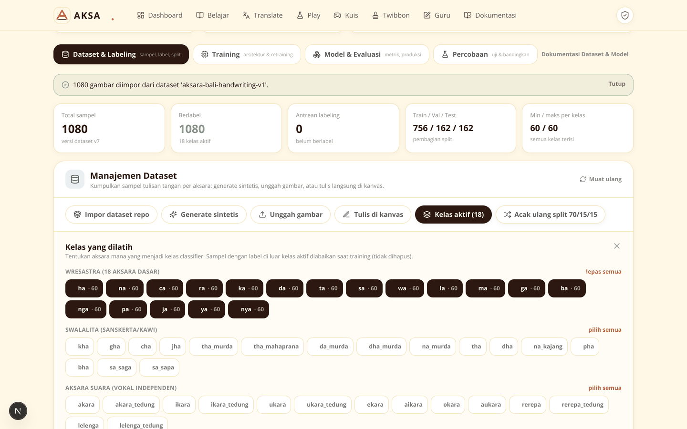
*Kelas aktif dikelompokkan (Wresastra, Swalalita, Suara, Angka) dengan jumlah sampel masing-masing.*

Sampel tanpa label muncul di tombol **Antrean labeling** (dengan jumlah). Klik kartu untuk membuka
detail, pilih label, split, status, lalu **Simpan**. Untuk banyak sampel: centang beberapa kartu →
bilah aksi massal (beri label, pindah split, tandai *review*, hapus).

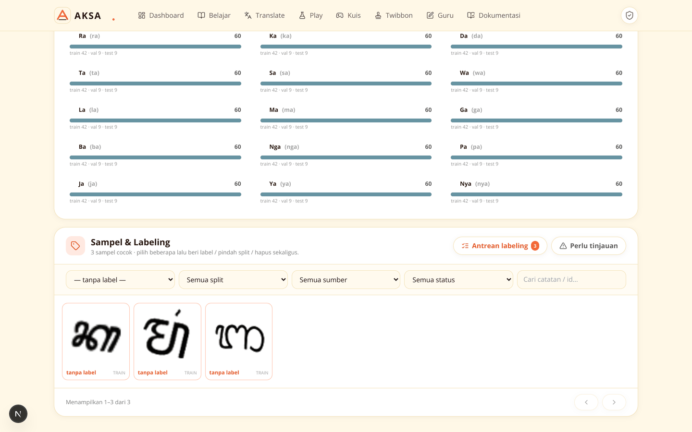
*Antrean labeling: tiga unggahan tanpa label. Filter label/split/sumber/status di atas galeri.*

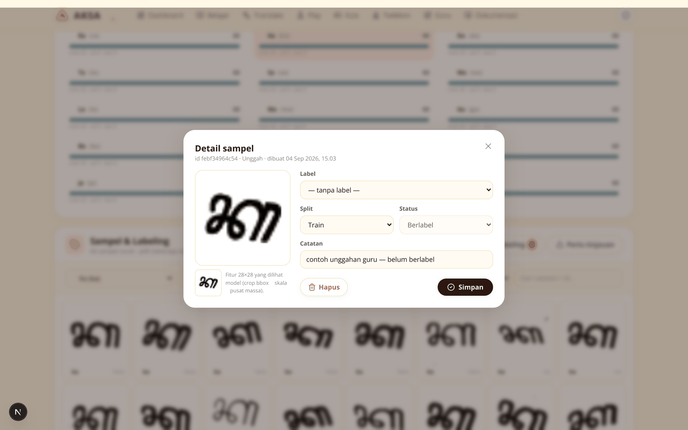
*Detail sampel: pratinjau fitur 28×28 yang “dilihat” model, pilih label & split, simpan atau hapus.*

> **Split & kebocoran data.** Setiap sampel punya split tetap; evaluasi hanya memakai split
> **test**. Setelah menambah banyak data baru, klik *Acak ulang split 70/15/15* agar tiap kelas
> terwakili di test secara proporsional. Jangan memindahkan sampel test ke train hanya untuk
> menaikkan angka.

---

## 4. Pilih arsitektur & jalankan retraining

Tab **Training** menampilkan banner kesiapan dataset, enam kartu arsitektur, dan form konfigurasi
yang menyesuaikan arsitektur terpilih.

| Arsitektur | Kapan dipakai | Perkiraan durasi* |
| --- | --- | --- |
| Template Matching (chamfer) | Baseline pembanding — tidak belajar dari data | < 1 dtk |
| Nearest Centroid | Sanity-check dataset | < 1 dtk |
| k-Nearest Neighbours | Data sangat sedikit; tanpa asumsi bentuk | < 1 dtk |
| Regresi Logistik | Data ≤ 20/kelas; cepat & stabil | ≈ 0.1 dtk |
| Multi-Layer Perceptron | Data 40+/kelas; akurat & masih cepat | ≈ 0.5–7 dtk |
| CNN | Akurasi terbaik, paling tahan variasi goresan | ≈ 6–15 dtk |

\*1.080 sampel, CPU 2 core, hyperparameter default.

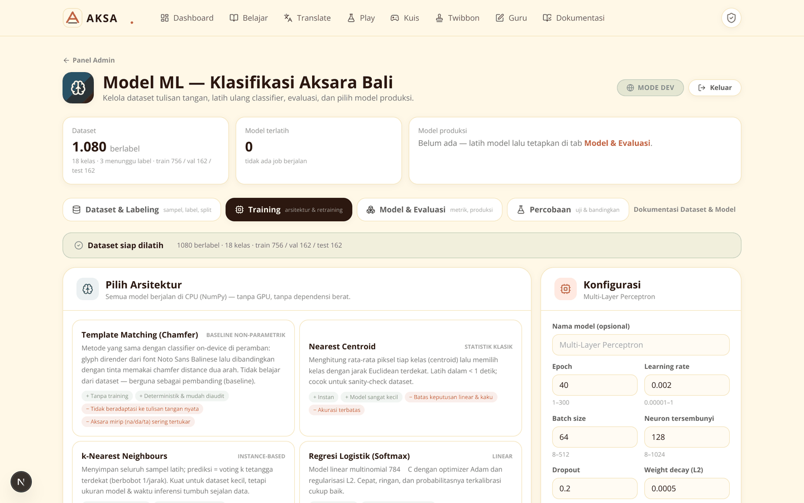
*Banner “Dataset siap dilatih”, kartu arsitektur dengan kelebihan/kekurangan, form konfigurasi di kanan.*

1. **Pilih arsitektur** — klik kartu (mis. *Convolutional Neural Network*); form hyperparameter berubah.
2. **Atur hyperparameter & nama** — default sudah aman. CNN: epoch 12–20, learning rate 0.004,
   batch 64. Beri nama deskriptif (*CNN v1 — dataset repo*) + catatan. Centang *langsung jadikan
   model produksi* hanya bila yakin.
3. **Mulai Retraining** — job berjalan di server; halaman boleh ditinggal.

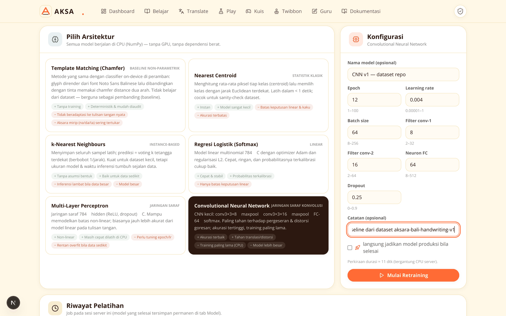
*Konfigurasi CNN: epoch, learning rate, batch size, filter conv-1/2, neuron FC, dropout, nama, catatan, opsi auto-promosi.*

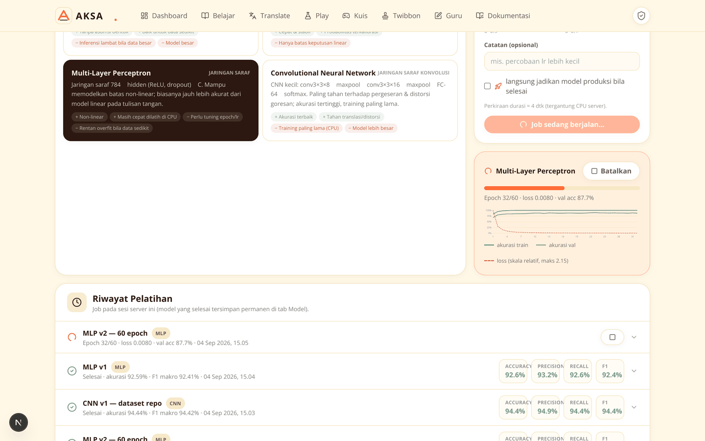
*Job berjalan: progress bar, epoch saat ini, loss & val acc, kurva train-vs-val live, tombol Batalkan; riwayat job di bawah.*

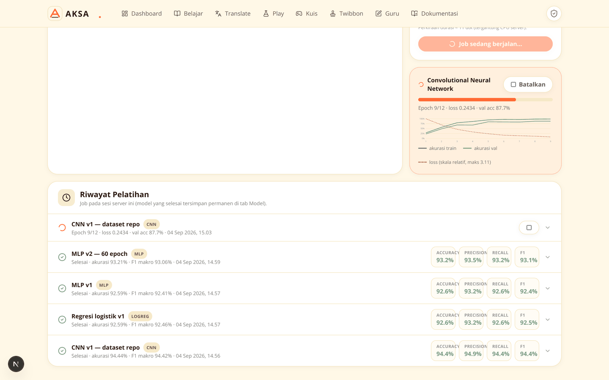
*Selesai: ringkasan accuracy / precision / recall / F1 langsung tampil di riwayat; model tersimpan di registry.*

> **Membaca kurva.** Akurasi *train* terus naik sementara *val* stagnan/turun = overfit →
> kurangi epoch, naikkan dropout/weight decay, atau tambah data. Loss tidak turun sama sekali =
> learning rate terlalu besar/kecil.

Hasil pada paket dataset repo (split manifest, CPU 2 core) — angka persis seperti pada screenshot:

| Model | Epoch | Accuracy | Precision (makro) | Recall (makro) | F1 (makro) | Durasi |
| --- | --- | --- | --- | --- | --- | --- |
| Regresi logistik v1 | 300 iter | 92.6 % | 93.0 % | 92.6 % | 92.5 % | 0.1 dtk |
| MLP v1 | 40 | 92.6 % | 92.9 % | 92.6 % | 92.4 % | 0.6 dtk |
| MLP v2 | 60 | 93.2 % | 93.5 % | 93.2 % | 93.1 % | 6.8 dtk |
| **CNN v1 — dataset repo** | 12 | **94.4 %** | 94.9 % | 94.4 % | **94.4 %** | 15.2 dtk |

(CNN 40 epoch pada dataset yang sama mencapai 98.2 % — lihat `eval/results/ml_experiments.md`.)

---

## 5. Baca laporan evaluasi

Tab **Model & Evaluasi** memuat registry semua model. Kolom bisa diurutkan; label *F1 terbaik* dan
*overfit?* (train acc − test acc > 15 poin) membantu memilih. Klik baris untuk laporan lengkap.

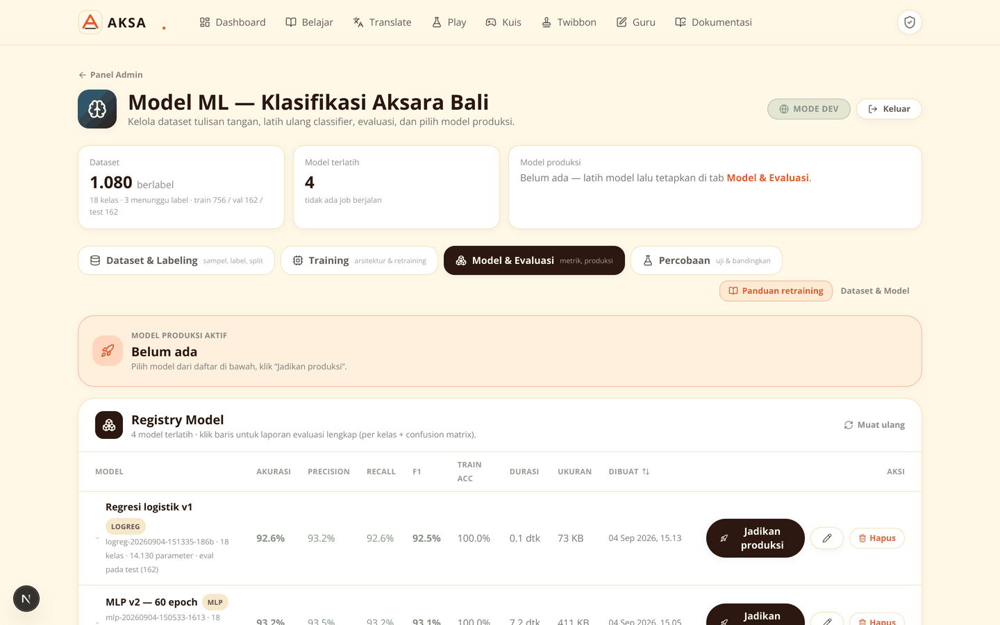
*Registry: bandingkan accuracy, precision, recall, F1 makro, train acc, durasi, ukuran.*

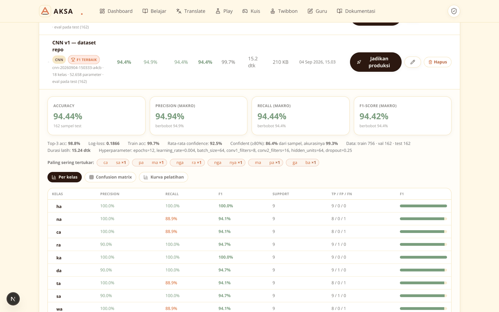
*Laporan CNN v1: tile accuracy / precision / recall / F1 (makro & berbobot), top-3, log-loss, confident-rate, ukuran split, hyperparameter, pasangan paling sering tertukar.*

| Metrik | Arti praktis |
| --- | --- |
| Accuracy | Proporsi sampel test yang ditebak benar. |
| Precision (per kelas) | Dari semua tebakan “ka”, berapa yang benar-benar ka — rendah = model sering salah menebak kelas itu. |
| Recall (per kelas) | Dari semua ka sebenarnya, berapa yang tertangkap — rendah = kelas sering terlewat. |
| F1 | Rata-rata harmonik precision & recall; angka utama untuk membandingkan model. |
| Makro vs berbobot | Makro: tiap kelas bobot sama. Berbobot: proporsional jumlah sampel. |
| Top-3 / Log-loss | Jawaban benar ada di 3 teratas; kalibrasi probabilitas (kecil = baik). |
| Train acc vs test acc | Selisih besar = overfit. |

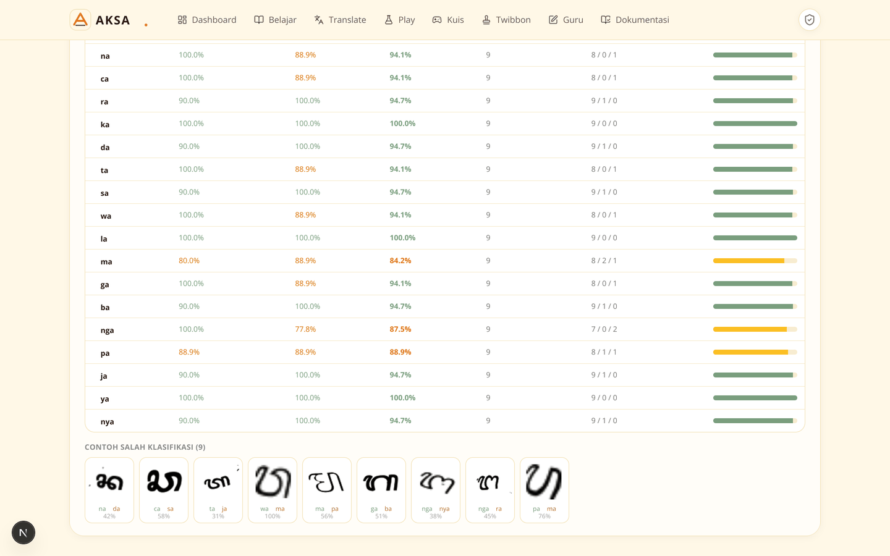
*Per kelas: precision / recall / F1 / support / TP-FP-FN dengan bar F1 — cepat terlihat aksara mana yang lemah.*

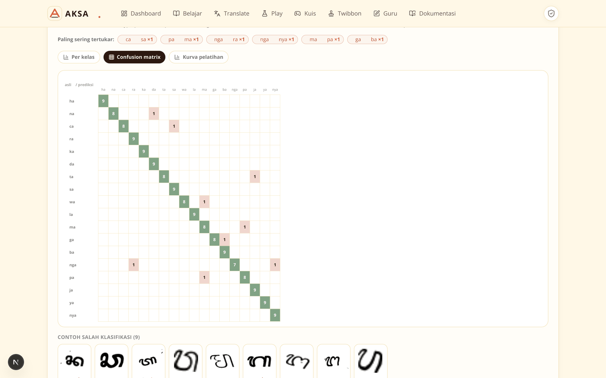
*Confusion matrix (baris = label asli, kolom = prediksi) + galeri contoh salah klasifikasi.*

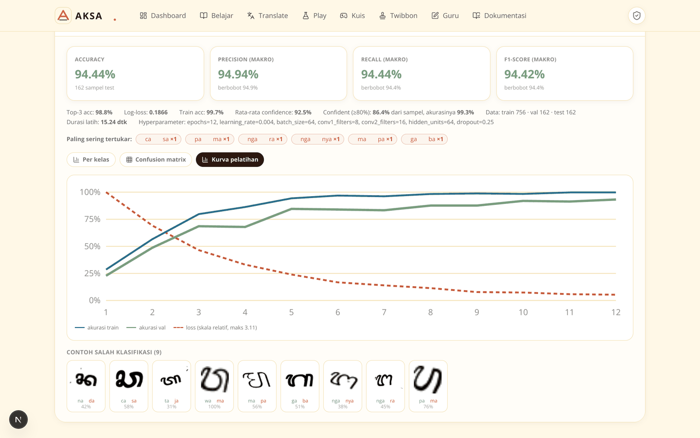
*Kurva pelatihan per epoch (loss, akurasi train vs val) tersimpan bersama model.*

---

## 6. Tetapkan model produksi

Klik **Jadikan produksi** pada baris model pilihan. Banner hijau di atas registry menandai model
aktif; sejak itu `POST /api/ml/predict` (tanpa `model_id`) memakai model tersebut. Tombol daya di
banner menonaktifkan produksi; model produksi tidak bisa dihapus sebelum dinonaktifkan.

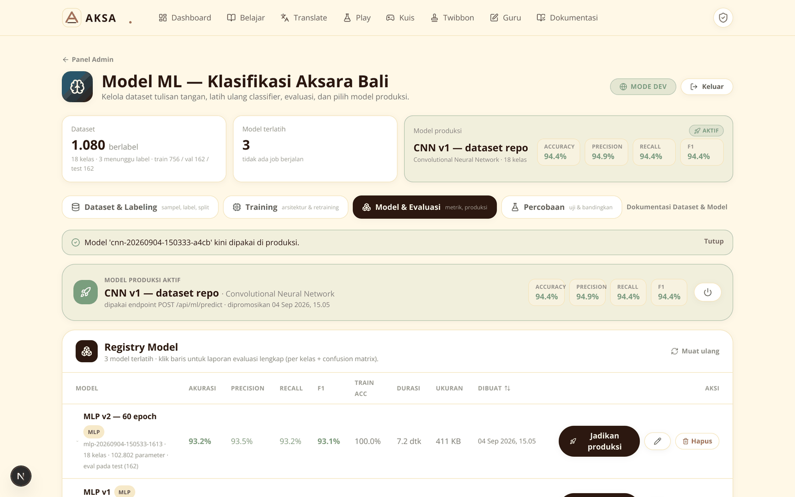
*CNN v1 kini model produksi: banner hijau + ringkasan metrik; kartu status di atas ikut berubah.*

**Kriteria promosi yang disarankan:** F1 makro tertinggi **dan** tidak ada kelas dengan
recall < 60 % **dan** selisih train–test < 15 poin. Bila dua model setara, pilih yang lebih
kecil/cepat (MLP/logreg) untuk server terbatas, atau CNN bila tulisan pengguna sangat bervariasi.

---

## 7. Uji, bandingkan, koreksi

Tab **Percobaan** menutup siklus: tulis aksara (atau unggah gambar), pilih *target* bila ingin
menilai, klik **Prediksi**. Hasil menampilkan top-k probabilitas, margin, dan pratinjau fitur 28×28.

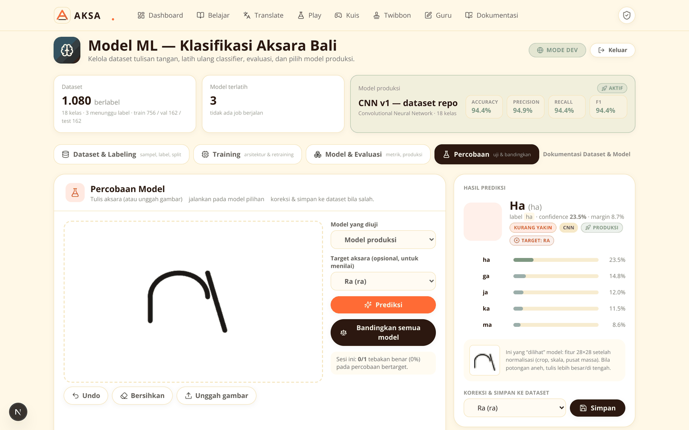
*Contoh prediksi yang RAGU (23.5 %, “kurang yakin”): coretan sederhana tidak mirip aksara mana pun — kandidat koreksi.*

1. **Bandingkan semua model** — input yang sama dijalankan ke seluruh registry.
2. **Koreksi & simpan ke dataset** — pilih label benar → *Simpan*; sampel masuk dataset (sumber: kanvas).
3. **Retraining ulang** — setelah terkumpul cukup koreksi (idealnya ≥ 20 per kelas lemah), ulangi §4
   dan bandingkan F1 sebelum–sesudah di registry.

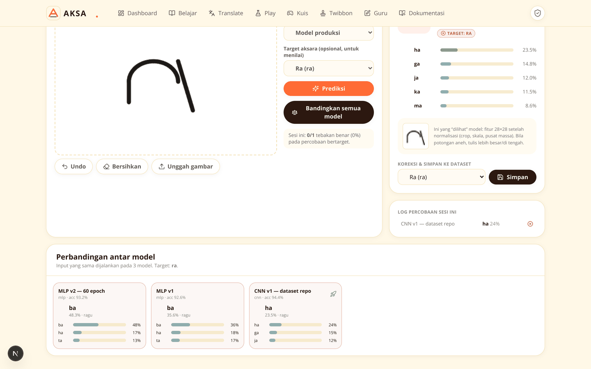
*Perbandingan antar model untuk input yang sama — tiga model ragu dengan jawaban berbeda: bentuk ini belum ada di dataset.*

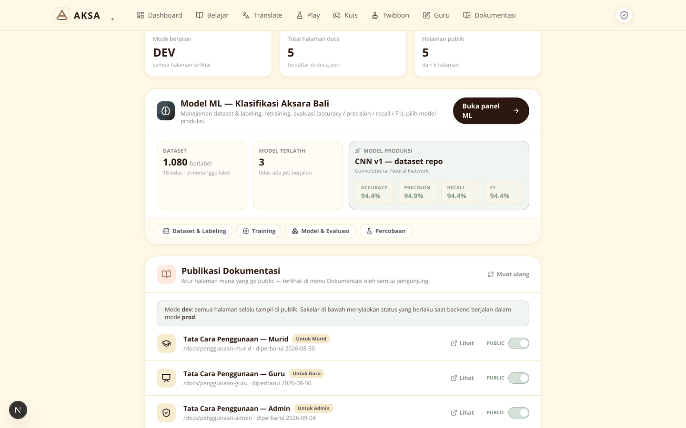
*Kembali ke `/admin`: ringkasan menampilkan dataset, jumlah model, dan model produksi beserta metriknya.*

---

## 8. Alur yang sama lewat API (otomasi)

```bash
# 1. impor dataset repo (admin) — idempoten
curl -X POST http://localhost:8000/api/ml/dataset/import-bundled \
  -H "Content-Type: application/json" -H "Authorization: Bearer $SESSION" \
  -d '{"name":"aksara-bali-handwriting-v1"}'
# → {"name":..., "added":1080, "removed":0, "skipped":0, "classes":18, "seconds":3.1, "stats":{...}}

# 2. tambah sampel (berlabel / tanpa label) & labeling
curl -X POST http://localhost:8000/api/ml/dataset/samples -H "Authorization: Bearer $SESSION" \
  -H "Content-Type: application/json" -d '{"image":"data:image/png;base64,...","label":"ka","source":"upload"}'
curl -X PATCH http://localhost:8000/api/ml/dataset/samples/<id> -H "Authorization: Bearer $SESSION" \
  -H "Content-Type: application/json" -d '{"label":"ka","split":"train"}'

# 3. retraining → 202 + job id, lalu pantau
curl -X POST http://localhost:8000/api/ml/train -H "Authorization: Bearer $SESSION" \
  -H "Content-Type: application/json" -d '{"arch":"cnn","hyperparams":{"epochs":15},"name":"CNN v1"}'
curl -H "Authorization: Bearer $SESSION" http://localhost:8000/api/ml/train/jobs/<job_id>

# 4–5. laporan evaluasi & promosi
curl -H "Authorization: Bearer $SESSION" http://localhost:8000/api/ml/models/<model_id>
curl -X PUT http://localhost:8000/api/ml/models/production -H "Authorization: Bearer $SESSION" \
  -H "Content-Type: application/json" -d '{"model_id":"<model_id>"}'

# 6. prediksi (publik)
curl -X POST http://localhost:8000/api/ml/predict -H "Content-Type: application/json" \
  -d '{"image":"data:image/png;base64,...","top_k":5}'
```

Spesifikasi lengkap: [`API_SPEC.md`](API_SPEC.md) (bagian ML). Benchmark reproducible:
`.venv/bin/python eval/ml_experiments.py --ablation`.

---

## 9. Pemecahan masalah

| Gejala | Penyebab umum | Solusi |
| --- | --- | --- |
| “Mulai Retraining” menolak: kelas tanpa sampel | Kelas aktif punya 0 data | Nonaktifkan kelas itu di *Kelas aktif*, atau tambah data |
| “Masih ada job yang berjalan” | Hanya satu job per server | Tunggu selesai atau *Batalkan* di kartu job |
| Akurasi bagus di test, jelek di tulisan nyata | Dataset didominasi sintetis | Kumpulkan tinta nyata (unggah/kanvas/koreksi), acak ulang split, latih ulang |
| Train acc 100 %, test jauh di bawah | Overfit | Kurangi epoch, naikkan dropout/weight decay, tambah data |
| Prediksi selalu “kurang yakin” | Goresan terlalu kecil/terpotong | Tulis besar di tengah kanvas; cek pratinjau 28×28 |
| Paket dataset repo tidak muncul | Folder `dataset/` tidak ada di server | Set env `AKSARA_DATASET_DIR`, atau bangun ulang dengan `eval/build_dataset.py` |
| Model produksi tidak bisa dihapus | Masih aktif | Nonaktifkan lewat tombol daya di banner, lalu hapus |

---

## Memperbarui screenshot

Screenshot dibuat dari alur nyata dengan Chromium headless 1440×900 dan disimpan di
`frontend/public/screenshots/ml/NN-nama.png` (PNG 8-bit, ± 90 KB/berkas). Bila UI berubah,
ulangi alur di atas pada instance dev (`python run.py`), tangkap layar dengan nama berkas yang
sama, lalu perbarui keterangan di halaman ini dan di
`frontend/components/docs/content-retraining.tsx`.
